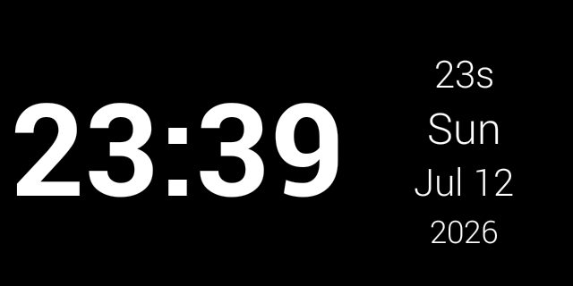
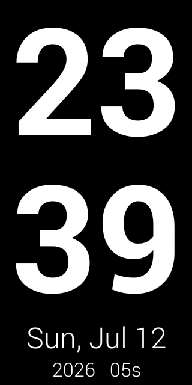
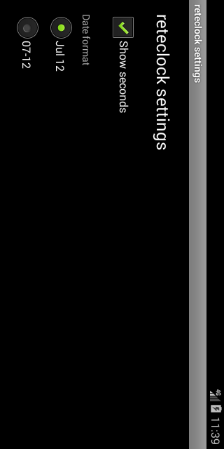

# reteclock

A full-screen digital clock and dock screensaver for Android, built for old devices first.

Plug the phone into a charger, put it on a stand, and it shows the time in large digits with the
weekday and date. It keeps the screen on, adapts to landscape and portrait, and slowly shifts what
it draws so an OLED panel does not burn in.

## Download

**[⬇ Download reteclock-0.2.0.apk](https://github.com/rubidus-api/reteclock_apk/releases/latest/download/reteclock-0.2.0.apk)** — 58 KB, installs on Android 2.3 and newer.

Open the file on the phone to install it. On Android 4.4, enable Settings > Security > Unknown
sources first. All releases: [Releases](https://github.com/rubidus-api/reteclock_apk/releases).

## Status

Working APK, version 0.2.0. Reference platform: Android 4.4 KitKat (API 19).

## Supported Android versions

| | |
|---|---|
| Minimum | **Android 2.3 Gingerbread (API 9)** |
| Built and tested on | **Android 4.4 KitKat (API 19)** — the reference platform |
| Maximum | **no upper limit**: `targetSdkVersion 28` keeps current Android versions (14, 15, 16 …) willing to install the APK |

The settings screen shows the same range on the device, together with the Android version it is
running on.

## What it looks like

Screenshots taken on Android 4.4.2.

| Landscape (wide) | Portrait (tall) |
|---|---|
|  |  |

The hour and the minute are bold and take every pixel the other lines do not need. The remaining
lines are scaled to the space that is left, so nothing is ever clipped. All text is white.

## Compatibility

- `minSdkVersion 9` (Android 2.3) through current Android; built and verified against the
  Android 4.4 (API 19) platform.
- Framework APIs only: no AndroidX, no support library, no Kotlin runtime, no third-party
  dependency, a single `classes.dex`, and an APK well under 100 KB.
- Signed with the v1 (JAR) scheme so old devices accept it, plus v2 and v3 so current Android
  versions accept it.
- Only a normal permission (`WAKE_LOCK`); nothing is requested at runtime.

## Settings

Long press the clock to open the settings screen:




- **Show seconds** — on or off. With the seconds off, the hour and the minute grow into the freed space.
- **Date format** — `Jul 12` (abbreviated month name) or `07-12` (numeric).
- **Start when the charger is connected** — on or off.

## How it starts

- From the launcher, like any app.
- Automatically when the charger is connected (turn this on or off in the settings).
  Android 10 and newer block starting an activity from the background, so on those devices use
  the launcher or the screensaver instead.
- As a system screensaver (Daydream) on Android 4.2 and newer:
  Settings > Display > Daydream > reteclock.
- From a desk dock, if the device reports one.

## Stack

Java, Android framework only. Built with the Android SDK command-line tools (`aapt2`, `javac`,
`d8`, `zipalign`, `apksigner`) driven by POSIX shell scripts. No Gradle.

## Build

```sh
scripts/test.sh          # JVM unit tests for the clock core
scripts/build.sh         # dist/reteclock-<version>-debug.apk
scripts/build.sh --release
```

Set `JAVA_HOME`, `ANDROID_SDK_ROOT` and `JUNIT_JAR` first; see `scripts/env.sh` and
`docs/manual/build.md`.

## Documentation

- `docs/manual/` — build and install instructions
- `docs/agents/` — working rules for AI-assisted sessions

## License

MIT. See `LICENSE`.
