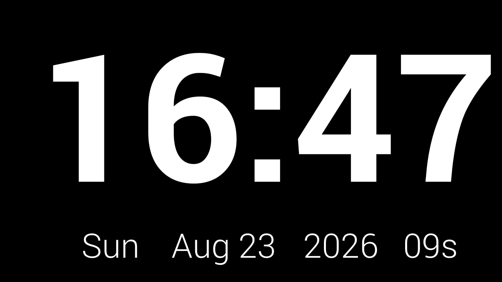
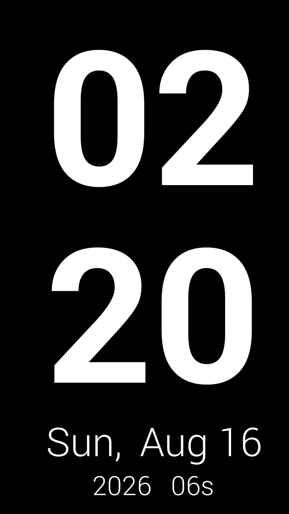
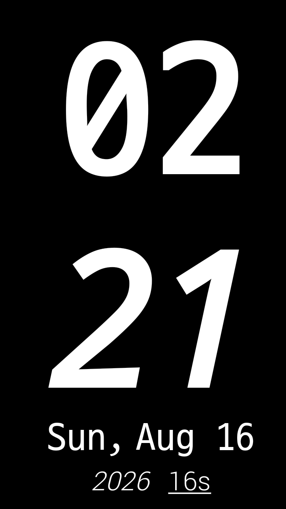
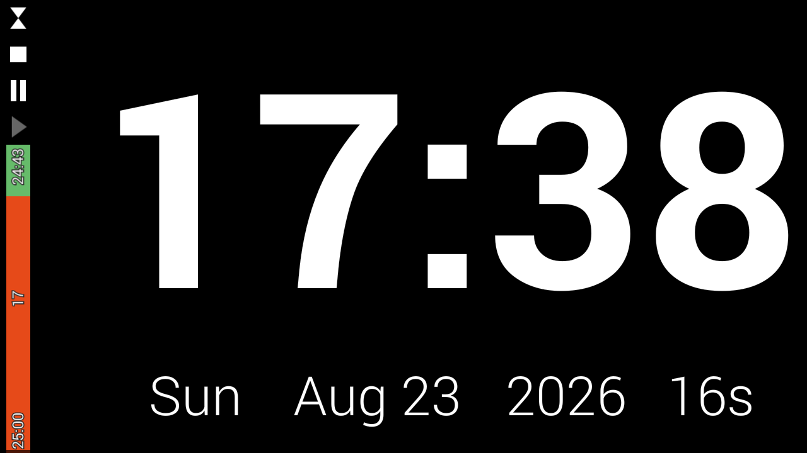
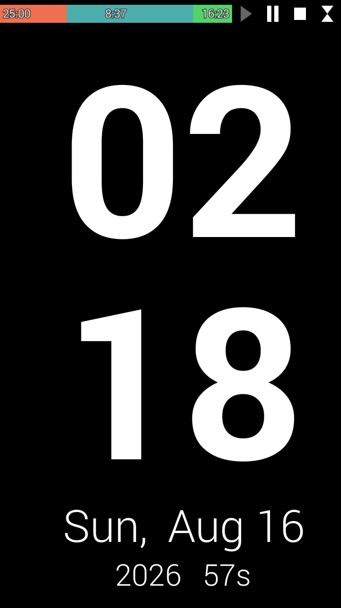
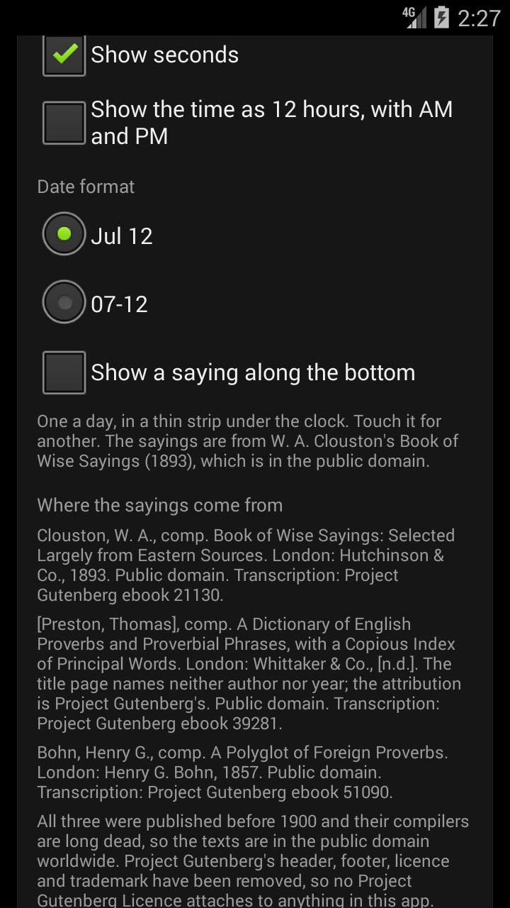
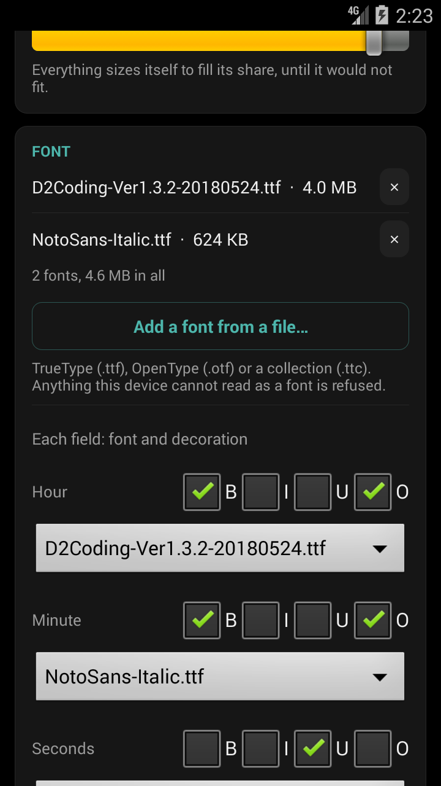
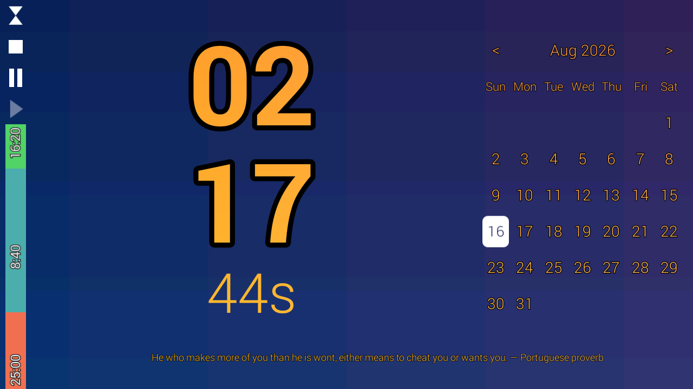
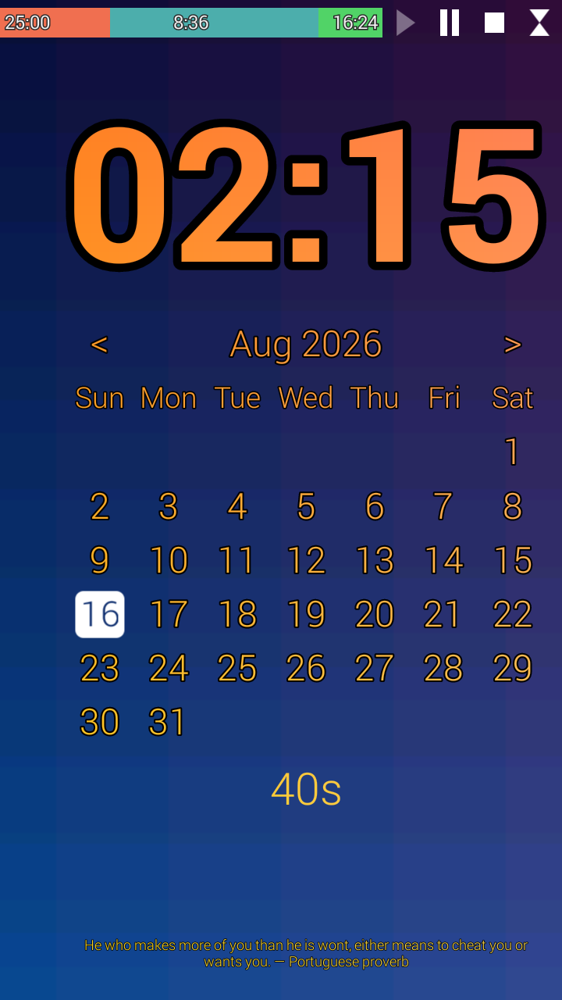

# reteclock

**English** · [한국어](README.ko.md)

**Turn an old Android phone into a bedside or desk clock.**

Plug the phone into its charger, stand it up, and reteclock fills the screen with the time in big
digits, along with the weekday and the date. It keeps the screen on while it runs, rearranges
itself when you turn the phone sideways, and quietly shifts what it draws by a pixel now and then
so the numbers never burn into an OLED screen.

There is nothing to sign up for and nothing to configure. It needs no account, no network and no
Play Store, so it still works on phones that can no longer install anything else. It is small —
about 280 KB — and asks for two permissions, both granted at install and never at runtime: one to
keep the screen awake, and one to vibrate, which only the timer uses.

> **If the clock does not answer your touch, it is not the clock.** Android does not pass touches to
> a screensaver (Daydream) or to anything showing over the lock screen — the first touch wakes the
> phone or dismisses the screensaver instead, and the app never hears it. So the menu, the timer's
> buttons, the calendar's arrows and the saying all do nothing there. To have a clock you can
> actually touch, run it as an app and turn on **Stay unlocked** in the settings: the screen stays
> on, the lock screen never covers it, and no screensaver takes over — and every touch reaches the
> clock.

## Download

**[⬇ Get it on F-Droid](https://f-droid.org/packages/com.reteclock/)** — recommended.

**[⬇ Download reteclock-0.20.0.apk](https://github.com/rubidus-api/reteclock_apk/releases/download/v0.20.0/reteclock-0.20.0.apk)**
— 277 KB, installs on Android 2.3 and newer. This is the file itself, so an old browser that cannot
render GitHub's release page can still fetch it.

The newest release is always at
[releases/latest](https://github.com/rubidus-api/reteclock_apk/releases/latest), and every release
is listed on the [Releases page](https://github.com/rubidus-api/reteclock_apk/releases).

### Setting it up, step by step

1. **Install it.** In F-Droid, search for *reteclock* and tap Install. If you downloaded the APK
   instead, open the file on the phone and confirm. On Android 4.4 and similar versions you may
   first have to allow installs from unknown sources, under Settings > Security.
2. **Open it** from the app list. The settings open first, with **Start the clock** at the top —
   there is nothing you have to set. If you would rather the button went straight to the clock,
   there is a switch for that on the same card.
3. **Press and hold the clock** whenever you want the settings again: colours, fonts, what is shown,
   and how large the time should be.
4. **Leave it on a stand, plugged in.** If you turn on *Start when the charger is connected*, the
   clock will come up by itself every time you plug the phone in.

To stop it, press Back or Home as with any app.

### Why F-Droid is the safer place to get it

You do not have to read this part to use the app — but if you have ever wondered whether an APK
from the internet is safe, here is the honest answer.

Downloading an APK from anywhere means trusting whoever built it. Nothing inside a finished APK
proves it was really made from the source code you can read here, and nothing proves that the
account which uploaded it had not been taken over by someone else.

F-Droid takes that trust out of the equation. Its listing is a
[reproducible build](https://f-droid.org/docs/Reproducible_Builds): F-Droid fetches this repository
onto its own server, compiles it there, and compares the result byte for byte with the APK
published above. It offers the app only if the two match. So the file F-Droid hands you is one an
independent party has confirmed came from the source in front of you — not merely one that somebody
with access to this repository uploaded. The F-Droid app also checks the signature on every update.

Both places serve the very same signed file, so you can move between them without uninstalling
anything.

The one cost is time. F-Droid rebuilds and republishes on its own schedule, so its copy is
sometimes a release or two behind this page. That wait is what you trade for having somebody else
check the build. If you are ever unsure about the download here, use F-Droid.

How the build recipe works and how it is verified:
[`docs/fdroid/README.md`](docs/fdroid/README.md).

## What it looks like

Screenshots taken on Android 4.4.2.

| Landscape (wide) | Portrait (tall) |
|---|---|
|  |  |

The hour and the minute take every pixel the other lines do not need, and those lines are then
sized to whatever is left, so nothing is ever cut off, whatever phone you run it on. The text and
background colours are yours to choose. Boldness is one of the decorations you set line by line:
the hour and the minute start out bold, and you can turn that off.

Every line can be drawn in a font of your own, each with its own bold, italic, underline and outline. In the
picture below, the hour uses a TrueType font, the minute a font collection and the weekday and date
an OpenType one; the year is italic and the seconds are underlined. Every size was worked out by
the app.



You can also put your own pictures behind the clock — several take turns, and animated GIFs play —
fill the digits themselves with a picture, and decide how much of the screen the time should take.
It is all in [Settings](#settings).

### The timer

Switched on, an interval timer runs beside the clock — a pomodoro, a round of tabata, three minutes
for tea. The strip carries the whole preset: each interval takes the share of the length its
duration is worth, and wears one colour before the bar reaches it and another after, so the shape
of the session is there at a glance. The three times inside the bar are the current interval's
length, how far into it you are, and what is left of it.

| Landscape (wide) | Portrait (tall) |
|---|---|
|  |  |

Eight minutes into a twenty-five minute stretch of work, with five minutes of rest waiting behind
it. Switched off, the clock is exactly as it was: no strip, no controls, nothing extra drawn.

## What it is for

An old Android phone in a drawer is still a perfectly good screen with a perfectly good clock
inside it. This app is for exactly that: stand the phone up, plug in the charger, and let it be a
bedside or desk clock.

Old phones are hard to use for much else nowadays. Google has been retiring old Android versions
step by step — signing in to a Google account stopped working on Android 2.3.7 and older in
September 2021, Google Play services stopped being updated for Android 4.4 KitKat in 2023, and most
apps in the Play Store now require a far newer Android. But a phone that can no longer install
anything can still show you the time.

So reteclock asks for nothing: no Play Store, no Google account, no network, and no permission
beyond keeping the screen awake. Copy the APK to the phone, open it, and the phone has a job again.

## Which phones it runs on

Published on F-Droid; the latest release is 0.20.0.

| | |
|---|---|
| Oldest | **Android 2.3 Gingerbread** (2010) |
| Built and tested on | **Android 4.4 KitKat** (2013) — the reference platform |
| Newest | **no limit** — current Android versions (14, 15, 16 …) install it happily |

The settings screen shows this same range on the phone itself, next to the Android version it is
running, so you never have to guess.

## Settings

**The home-screen button opens the settings**, and so does **pressing and holding the clock**. The
clock says so once when you first open it, and stops mentioning it after you have been there — and
it never mentions it when the charger started the clock, so it stays quiet on a bedside stand.

The button opens this screen rather than the clock on purpose. A full-screen clock has no controls
on its face, so if a picture or a font you added ever makes it unusable, this is the way back in.
And if the clock does stop answering, the next start leaves your images and fonts out and says so,
so you can undo whatever caused it.

 

In the order they appear on the screen.

**What is shown**

- **Show seconds** — on or off. With the seconds off, the hour and minute grow into the space they
  leave behind.
- **Date format** — `Jul 12` (short month name) or `07-12` (numbers).
- **Colours** — a text colour and a background colour, each chosen from a palette. The two can
  never be the same (a clock in its own background colour would be no clock at all), and the
  background colour shows wherever no picture covers it, including the bars at the edges when a
  picture is fitted whole.

**Fonts**

- **Font** — the clock uses the phone's own font until you add one of your own. *Add a font from a
  file* opens the usual file picker. The file is copied into the app, which is why reteclock never
  has to ask for permission to your storage, and why your font keeps working even if you later move
  or delete the original. TrueType (`.ttf`), OpenType (`.otf`) and font collections (`.ttc`) all
  work — the collection was really tried on Android 4.4 rather than assumed — and anything the
  phone cannot read is refused straight away instead of sitting broken in the list. The list shows
  how much space each font takes and the total, and any of them can be deleted.
- **Each line: font and decoration** — the hour, the minute, the seconds, the weekday, the month
  and day, and the year each choose their own font and their own **B**old, **I**talic and
  **U**nderline. The hour and minute begin bold; turn it off if you prefer. Sizes remain the app's
  job. If you delete a font that a line was using, that line simply goes back to the phone's font.
  A font file holds one weight and one slant, so bold and italic are drawn from it.

**Size**

- **Room for the time** — two sliders, one for each way you hold the phone: how much of the width
  the hour and minute take when it lies sideways, and how much of the height when it stands
  upright. Everything else sizes itself to fill its share, and stops growing before it would no
  longer fit.

**Pictures**

- **Images** — one pool holds every picture, brought in the same permission-free way as the fonts.
  Each picture has two ticks, and only one of them can be on: **BG** puts it behind the clock, and
  **Text** shows it inside the digits, so the numbers become a window onto the picture. With
  neither ticked it is simply kept, unused, until you want it. Each tick column has a select-all,
  and the first column is for picking several pictures to delete at once.
  Background pictures take turns: an animated GIF plays through once, a still picture stays for a
  time you choose (5 seconds to 5 minutes), each one cross-fades into the next unless you turn the
  fade off, and six fit modes between them handle any shape of picture. The pictures inside the
  digits cycle by the same rules. You can sort the pool by name or by the date each file was added,
  in either direction, arrange it by hand with the arrows, or tap a name to rename it — naming them
  `001 …`, `002 …` turns the A-to-Z sort into your own order. If you import a file the pool already
  has, it is recognised and not stored twice.

**Timer**

The clock can also run an interval timer — a pomodoro, a round of tabata, three minutes for tea. It
is off until you ask for it, and with it off the clock is exactly as it was: no strip, no controls,
nothing extra drawn.

- **Presets** — a preset is a named list of intervals. Each interval has its own length, typed in
  hours, minutes and seconds; two colours; a message spoken aloud at its beginning, if the phone has
  a speech engine; and a warning so many seconds before it ends. A preset can be told to repeat
  forever, which is what turns twenty seconds of work and ten of rest into a tabata.
- **On the clock face** — a strip runs down the left of the screen, or across the top when the phone
  stands upright. It carries the whole preset at once: each interval takes the share of the strip
  its length is worth, drawn in its own two colours — one for before the bar has reached it, one for
  after — so the shape of the session is there at a glance. Either colour may be left empty, and
  then the clock shows through. Three times are written inside the bar, all about the interval you
  are in: its length, how far into it you are, and what is left of it.
- **Counting in** — pressing play starts the preset three seconds later, with a low beep on each of
  those three seconds and a high one landing exactly on the start, so you can put the phone down and
  begin on the beat.
- **Sound, vibration or silence** — one setting covers everything the timer says. Whichever you
  choose, the end of each interval also flashes the screen three times. The tune at the end of a
  preset is the theme from the fourth movement of Schubert's *Trout* Quintet, which the phone plays
  from the notes rather than from a recording.
- **Putting it away** — the hourglass at the end of the strip opens the list of presets, and the
  first item there hides the timer. The strip empties, leaving the hourglass where it was, and the
  clock keeps exactly the shape and size it had. A timer that is running keeps running and keeps
  sounding; the same first item brings it back mid-count.

**Settings file**

- **Export / Import** — everything you have arranged can be written to a file and read back on
  another phone, or kept as a backup. Pictures and fonts are not carried in it: names of ones the
  other phone does not have are skipped, and it tells you how many. Neither direction asks for a
  storage permission.

**Calendar** — its own screen, reached from the clock's menu.

- **Show a calendar on the clock** — the month under the time, drawn as the clock's own writing: it
  takes the text colour, and the picture filling the digits fills it too. The month and a pair of
  arrows are on the first row, three-letter weekdays on the second, and six week rows always, so
  paging through the months does not make the grid breathe. Today is knocked out of a filled box —
  the numerals are cleared from the colour rather than painted over it, so a picture behind the
  clock shows through the digits themselves. The arrows page back and forth, and it returns to this
  month whenever the clock is opened again.
- **The week starts on** — Sunday or Monday.
- **The month is written as** — `Aug 2026` or `2026-08`.

| Landscape (wide) | Portrait (tall) |
|---|---|
|  |  |

  Both shots have a picture behind the clock and a second picture filling the writing, which is why
  the numerals are orange over blue — and why today's date shows the background through the digits
  rather than a colour.

  If the clock looks a little off-centre in these, that is on purpose and not a slip. Everything on
  the screen drifts very slowly — a few pixels at a time, around a circle it takes a long while to
  complete — so that no bright shape sits on the same pixels for hours. It is why a phone can be
  left showing this for years without the numbers etching themselves into the panel. The drift
  never leaves the margin, so nothing is ever clipped. That slow wandering is the app looking after
  your display.

  With the calendar on, the clock rearranges itself around it. Sideways, the time reads down the
  left — hour, minute, and the seconds smaller beneath — and the calendar takes the whole of the
  side column where the date and year used to be. Upright, the time becomes one line above the
  grid. Either way the weekday, the date and the year go: the calendar says them better. The slider
  that decides how much room the time takes still decides it.

**A saying**

- **Show a saying along the bottom** — a thin strip under the clock, about as deep as the timer's,
  carrying one saying and who said it. One a day, the same one all day, since a clock that changed
  what it said while you looked at it would be a thing that moves. Touch it for another. It wraps
  to one, two or three lines depending on how long it is and how much room the strip has, and it
  chooses its own font and decoration in the list of fields like every other line does.

  There are 6,678 of them, drawn from three nineteenth-century collections and all in the public
  domain by age:

  - Clouston, W. A., comp. *Book of Wise Sayings: Selected Largely from Eastern Sources*. London:
    Hutchinson & Co., 1893. 289 sayings, from eighty-three named hands — Sa'dí, Firdausí, the
    Dhammapada, the Hitopadesa, Goethe among them.
  - [Preston, Thomas], comp. *A Dictionary of English Proverbs and Proverbial Phrases*. London:
    Whittaker & Co., [n.d.]. 1,334 English proverbs. The title page names neither author nor year;
    the attribution is Project Gutenberg's.
  - Bohn, Henry G., comp. *A Polyglot of Foreign Proverbs*. London: Henry G. Bohn, 1857. 5,055
    proverbs in English rendering, marked by the language they came from — Spanish, Italian,
    French, Danish, Dutch and Portuguese.

  All three were published before 1900 and their compilers are long dead, so the texts are in the
  public domain worldwide. The transcriptions came from Project Gutenberg (ebooks 21130, 39281 and
  51090) with that project's header, footer and licence removed and its trademark unused, so
  nothing here carries any licence but this app's. They are all in
  `src/android/res/raw/quotes.txt`, one saying to a line, should you want to read them or replace
  them. The same citations are in `LICENSE`, and in the settings under the switch that turns them
  on.

**Starting**

- **Start when the charger is connected** — on or off. See below for what to do on newer Android.
- **Stay unlocked** — keeps the clock up past the lock screen: the screen never sleeps, the lock
  screen never covers it, and no screensaver takes over. Off by default, since showing over a lock
  screen is not something to do to somebody unasked.

## How to start it

- **From the app list**, like any other app.
- **Automatically when you plug in the charger** — switch this on in the settings. Android 10 and
  newer do not let an app open itself this way, so on those phones use the app list or the
  screensaver instead.
- **As the system screensaver** (Android calls it Daydream) on Android 4.2 and newer:
  Settings > Display > Daydream > reteclock.
- **From a desk dock**, if the phone reports being docked.

## For developers

Nothing below is needed to use the app.

### Stack

Java and the Android framework, nothing else. Built with the Android SDK command-line tools
(`aapt2`, `javac`, `d8`, `zipalign`, `apksigner`) driven by POSIX shell scripts. No Gradle. No
AndroidX, no support library, no Kotlin runtime and no third-party dependency — a single
`classes.dex` and an APK of about 280 KB. It is signed with the v1 (JAR) scheme so old phones
accept it, plus v2 and v3 for current ones, and it holds two normal permissions (`WAKE_LOCK` and
`VIBRATE`, the latter for the timer), both granted at install and never requested at runtime.

### Build

When this checkout sits inside the ai-share workspace, `scripts/build.sh` picks up the shared JDK
and Android SDK from the sibling `usr/` directory by itself. Anywhere else, point it at your tools:

```sh
export JAVA_HOME=/path/to/jdk-21              # only --release insists on this exact major version
export ANDROID_SDK_ROOT=/path/to/android-sdk   # build-tools 35.0.0 + platforms;android-19

scripts/build.sh             # dist/reteclock-<version>-debug.apk, signed with a local dev key
scripts/build.sh --release   # signed with your own release key (RETECLOCK_KEYSTORE)
scripts/build.sh --unsigned  # dist/reteclock-<version>-unsigned.apk, for F-Droid to sign
```

`scripts/build.sh` runs `aapt2` → `javac` (source 8, against the API 19 platform) → `d8`
(`--min-api 9`) → `zipalign` → `apksigner` (v1 + v2 + v3). It needs a JDK, the Android SDK
command-line tools, and Python 3. Any JDK will do for a debug build; `--release` requires JDK 21,
because F-Droid rebuilds the app and compares the result against the published APK, and different
javac versions do not produce identical bytecode. Nothing else — no Gradle, no downloads, no
dependencies. Every variable it reads is listed in `scripts/env.sh`.

This repository publishes only what is needed to build the app, plus this README with its
screenshots and the F-Droid submission material (`fastlane/`, `docs/fdroid/`). Working notes, plans
and test scaffolding are deliberately kept out of it.

## The name

**rete** is Latin for *net*, and *-clock* is just a clock.

The intended pronunciation is the Latin one: **RAY-teh** (two syllables, `rē-te`; the first vowel is
the long *e* of *they*, and the final *e* is pronounced, never silent).

If you would rather say it the way English usually treats this word, that is fine too. English
borrowed *rete* as an anatomical term and pronounces it **REE-tee**, so "REE-tee-clock" is a
perfectly good reading. Say it however you like; the clock does not mind.

## License

MIT. See `LICENSE`.
